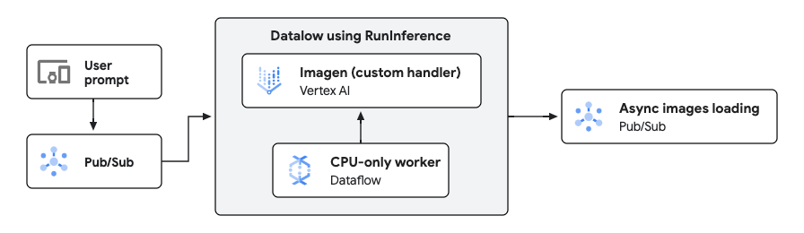

# Image generation sample pipeline (Python)

This sample pipeline demonstrates how to use Dataflow to produce images from prompts using
[Imagen on Vertex AI](https://cloud.google.com/vertex-ai/generative-ai/docs/image/overview). This
pipeline is written in Python.

This pipeline is part of the [Dataflow Gen AI & ML solution guide](../../use_cases/GenAI_ML.md).

## Architecture

The generic architecture for an inference pipeline looks like as follows:



In this directory, you will find a specific implementation of the above architecture, with the
following stages:

1. **Data ingestion:** Reads user prompts from a Pub/Sub topic.
2. **Data preprocessing:** The sample pipeline does not do any transformation, but they could be
   added to the pipeline.
3. **Inference:** Uses the RunInference transform with a custom model handler, to call the Imagen
   model on Vertex AI. Because the model is remote, the worker does not need any GPU.
4. **Predictions:** The images are uploaded to Cloud Storage, and the path of the generated files is
   published in Pub/Sub.

## Imagen model

You need to have access to
the [Imagen model on Vertex AI](https://cloud.google.com/vertex-ai/generative-ai/docs/image/overview)
to use this pipeline. You may need to request access to that model to use this pipeline.

## How to launch the pipeline

All the scripts are located in the `scripts` directory and prepared to be launched from the top
sources directory.

In the script `scripts/00_set_environment.sh`, define the value of the project id and the region
variable:

```
export PROJECT=<YOUR PROJECT ID>
export REGION=<YOUR CLOUD REGION>
```

Leave the rest of variables untouched, although you can override them if you prefer.

After you edit the script, load those variables into the environment

```sh
source scripts/00_set_environment.sh
```

You can then trigger the pipeline with the following:

```sh
./scripts/01_run_dataflow.sh
```

## Input data

To send data into the pipeline, you need to publish messages in the `prompts` topic. Those
messages are passed "as is" to Imagen, so you may want to add some prompting to the question.

## Output data

The predictions are published into the topic `predictions`, and can be observed using the
subscription `predictions-sub`. The messages will contain a path to the generated image, which will
be stored in the bucket configured by the Terraform blueprint, in a folder called `images`.